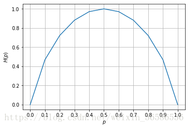
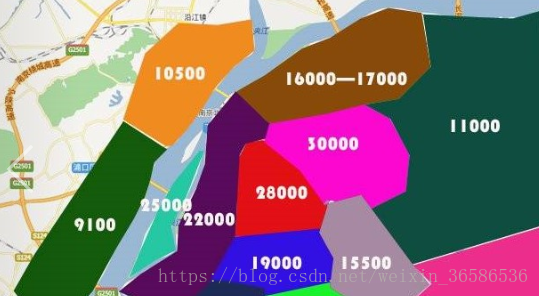

# 第3章 决策树
<script type="text/javascript" src="http://cdn.mathjax.org/mathjax/latest/MathJax.js?config=default"></script>

## 决策树 概述

​        决策树（Decision Tree）算法是一种基本的分类与回归方法，是最经常使用的数据挖掘算法之一。我们这章节只讨论用于分类的决策树。

​        决策树模型呈树形结构，在分类问题中，表示**基于特征**对实例进行分类的过程。它可以认为是 if-then 规则的集合，也可以认为是定义在特征空间与类空间上的条件概率分布。

​        决策树学习通常包括 3 个步骤: 

* 特征选择
* 决策树的生成
* 决策树的修剪

## 决策树 场景

​        一个叫做 "二十个问题" 的游戏，游戏的规则很简单: 参与游戏的一方在脑海中想某个事物，其他参与者向他提问，只允许提 20 个问题，问题的答案也只能用对或错回答。问问题的人通过推断分解，逐步缩小待猜测事物的范围，最后得到游戏的答案。

​        一个邮件分类系统，大致工作流程如下: 


```
首先检测发送邮件域名地址。如果地址为 myEmployer.com, 则将其放在分类 "无聊时需要阅读的邮件"中。
如果邮件不是来自这个域名，则检测邮件内容里是否包含单词 "曲棍球" , 如果包含则将邮件归类到 "需要及时处理的朋友邮件", 
如果不包含则将邮件归类到 "无需阅读的垃圾邮件" 。
```

**决策树的定义:** 

​        分类决策树模型是一种描述对实例进行分类的树形结构。决策树由结点（node）和有向边（directed edge）组成。结点有两种类型: 内部结点（internal node）和叶子结点（leaf node）：

* 内部结点：表示一个特征或属性 *(features)*
* 叶子结点：表示一个类 *(labels)*

​        用决策树对需要测试的实例进行分类: 从**根节点开始**，对实例的某一特征进行测试，根据测试结果，将实例分配到其子结点；这时，每一个子结点对应着该特征的一个取值。如此递归地对实例进行测试并分配，直至达到叶结点。最后将实例分配到叶结点的类中。

## 决策树 原理

### 决策树 须知概念

#### 信息熵 & 信息增益

##### 熵（entropy）: 

熵指的是体系的混乱的程度，在不同的学科中也有引申出的更为具体的定义，是各领域十分重要的参量。

##### 信息论（information theory）中的熵（香农熵）: 

是一种信息的度量方式，表示信息的混乱程度，也就是说: 信息越有序，信息熵越低。例如: 火柴有序放在火柴盒里，熵值很低，相反，熵值很高。

##### 信息增益（information gain）: 

在划分数据集前后信息**发生的变化**称为信息增益。


## 特征选择

原文：https://blog.csdn.net/weixin_36586536/article/details/80468426

​        **特征选择**也即<font color='red'>选择最优划分属性</font>，从当前数据的特征中选择一个特征作为当前节点的划分标准。在不断划分的过程中，决策树的分支节点所包含的样本尽可能属于同一类，即节点的“纯度”越来越高。而选择最优划分特征的标准不同，也导致了决策树算法的不同。

​        ***为了找到最优的划分特征***，需要先了解一些信息论的知识：

- 信息熵(*information entropy*)
- 信息增益(*information gain*)
- 信息增益率(*information gain ratio*)
- 基尼指数(*Gini index*)


### 熵

​        在信息论和概率统计中，熵(entropy)是**表示随机变量不确定性的度量**，设 $X$ 是一个取**有限**值的离散随机变量，其概率分布为：
$$
P(X = _i) = p_i, i = 1, 2,\cdots,n
$$
则随机变量 $X$ 的熵定义为：
$$
H(X) = - \sum_{i=1}^{n} p_i logp_i
$$
*上述公式中的对数通常以2为底* 。**熵越大，随机变量的不确定性越大。**

​        为了能够更好地理解熵的意义，下面举一个例子来说明。 
​        当随机变量只取两个值，如 $1,0$ 时，即 $X$ 的分布为 ：
$$
P(X = 1) = p,\  P(X = 0) = 1 - p, \  0 \le p \le 1
$$
则熵为 ：
$$
H(p)= -p log_{2}p-(1-p) log_2(1 - p)
$$
$H(p)$ 的函数图像如下： 



从图中不难看出：$ p=0 $ 或 $1$ 时 $H(p) = 0$，即不确定性为 $0$。当 $p=0.5$ 时，不确定性最大。


### 条件熵

​        设有随机变量 $(X,Y)$，条件熵 $H(Y|X)$ 表示在已知随机变量 $X$ 的条件下随机变量 $Y$ 的不确定性。随机变量 $X$ 给定的条件下随机变量 $Y$ 的条件熵 $H(Y|X)$ 定义为 $X$ 给定条件下 $Y$ 的条件概率分布的熵对 $X$ 的数学期望：
$$
H(Y|X) = \sum_{i=1}^{n} p_i H(Y|X = x_i)
$$
 这里，$p_i = P(X = x_i), \ i = 1,2, \cdots, n$

### 信息增益

**信息增益**：表示得知特征$X$ 的信息，而使得类$Y$ 的信息的**不确定性减少程度**。接下来给出定义：

特征$A$ 对训练数据集$D$ 的信息增益$g(D,A)$ ，为集合$D$ 的熵$H(D)$ 与特征$A$ 给定条件下$D$ 的条件熵$H(D|A)$ 之差：
$$
g(D,A) = H(D) - H(D|A)
$$

#### 信息增益的算法

* 输入与输出：
  * 输入：训练数据集$D$，特征$A$
  * 输出：特征$A$ 对训练数据集$D$ 的信息增益$g(D,A)$

* 计算过程和公式：

  * 计算数据集$D$ 的熵$H(D)$ ：$H(D) = - \sum_{k=1}^{K} \frac{|C_k|}{|D|} log_2 \frac{|C_k|}{|D|}$

  * 计算特征$A$ 对训练数据集$D$ 的条件熵$H(D|A)$：
    $$
    \begin{align}
    H(D|A) =& \sum_{i=1}^{n} \frac{|D_i|}{|D|} H(D_i) \\
     =& - \sum_{i=1}^{n} \frac{|D_i|}{|D|} \sum_{k=1}^{K} \frac{|D_{ik}|}{|D_i|} log_2 \frac{|D_{ik}|}{|D_i|}
    \end{align}
    $$
    
* 计算信息增益：$g(D,A) = H(D) - H(D|A)$

​        上述公式中，各个参数分别为：

* $|D|$ ：样本容量，设有$K$ 个类
* $C_k$：$k = 1,2, \cdots, K$
* $|C_k|$：$C_k$ 的样本个数

* 设特征$A$ 有 $n$ 个不同取值，根据特征$A$ 的取值，将 $D$ 划分为 $n$ 个子集 $D_1, D_2, \cdots, D_n$
* $D_{ik}$ ：为子集$D_i$ 中属于类$C_k$ 的集合

#### 信息增益率

​        特征$A$ 对训练数据集$D$ 的信息增益$g_R(D,A)$ 定义为其信息增益$g(D,A)$与训练数据集$D$关于特征$A$ 的值的熵$H_A(D)$ 之比，即：
$$
g_R(D,A) = \frac{g(D,A)}{H_A(D)}
$$
其中：

* $H_A(D) = - \sum_{i=1}^{n} \frac{|D_i|}{|D|} log_2 \frac{|D_i|}{|D|}$
* $n$ 是特征$A$ 取值的个数

注意区别 $H(D|A)$ 和 $H_A(D)$


#### 基尼指数

基尼指数 $Gini(D)$ 表示集合$D$ 不确定性，

基尼指数 $Gini(D,A = a)$ 表示集合$D$ 经 $A = a$ 分割后的不确定性（类似于熵），

***基尼指数越小，样本的不确定行越小***。

分类问题中，假设有 $K$ 个类，样本点属于第 $k$ 类的概率为 $p_k$，则概率分布的基尼指数定义为：
$$
Gini(p) = \sum_{k=1}^{K} p_k (1 - p_k) = 1 - \sum_{k=1}{K} p_k^2
$$
如果样本集合 $D$ 根据特征$A$ 是否取某一可能值 $a$ 被分割成 $D_1$ 和 $D_2$ 两部分，即 $D_1 = {(x,y) \in D | A(x) = a}, D_2 = D - D_1$， 则特征$A$ 的条件下，集合$D$ 的基尼指数定义为：
$$
Gini(D, A = a) = \frac{|D_1|}{|D|} Gini(D_1) + \frac{|D_2|}{|D|}Gini(D_2)
$$


## 决策树生成

决策树的生成大致有3种算法：

<table>
	<tr>
    	<th>生成算法</th>
        <th>划分标准</th>
    </tr>
    <tr>
    	<td>ID3</td>
        <td>信息增益</td>
    </tr>
    <tr>
        <td>C4.5</td>
        <td>信息增益率</td>
    </tr>
    <tr>
        <td>CART</td>
        <td>基尼指数</td>
    </tr>
</table>


### ID3

算法的核心是在决策树各个节点上根据信息增益来选择进行划分的特征，然后递归地构建决策树。 

**具体方法：**

1. 从根节点开始，对节点计算所有可能的特征的信息增益，选择信息增益值最大的特征作为节点的划分特征
2. 由该特征的不同取值建立子节点
3. 再对子节点递归地调用以上方法，构建决策树
4. 到所有特征的信息增益都很小或者没有特征可以选择为止，得到最终的决策树

**ID3算法的局限性：**

1. 没有剪枝

2. 采用信息增益作为选择最优划分特征的标准，然而**信息增益会偏向那些取值较多的特征**(这也是C4.5采用信息增益率的原因)

   

### C4.5

C4.5与ID3相似，但对ID3进行了改进，在这里不再详细描述C4.5的实现，就讲一下有哪些基于ID3的改进：

1. 用信息增益率来选择划分特征，克服了用信息增益选择的不足
2. 在构造树的过程中进行剪枝
3. 可对连续值与缺失值进行处理

***为什么C4.5要用信息增益率代替信息增益？为什么信息增益会偏向多取值特征？***

​        信息增益在面对**类别较少的离散数据**时效果较好，但是面对取值较多的特征时效果会很不如人意。关于信息增益对取值较多特征的偏向性，我认为原因是：当特征的取值较多时，根据此特征划分得到的子集纯度有更大的可能性会更高(对比与取值较少的特征)，因此划分之后的熵更低，由于划分前的熵是一定的，因此信息增益更大，因此信息增益比较偏向取值较多的特征。

​        举个较为极端的例子可能更好理解：如果特征A的取值能将每一个样本都分到一个节点当中去的时候(如编号等特征)，条件熵部分会为0，这意味着该情况下的信息增益达到了最大值，故ID3算法一定会选择特征A。但是，显然的，我们知道这个特征A显然不是最佳选择。 

​        那么为什么信息增益率就能改善这种情况呢？先来看一下信息增益率的计算公式： 
$$
g_R(D,A) = \frac{g(D,A)}{H_A(D)}
$$
其中：

1. $H_A(D) = - \sum_{i=1}^{n} \frac{|D_i|}{|D|} log_2 \frac{|D_i|}{|D|}$
2. $H_A(D)$ 又叫做特征$A$ 的内部信息，$H_A(D)$ 其实像是一个衡量以特征A的不同取值将数据集$D$ 分类后的不确定性的度量。
3. 如果特征$A$的取值越多，那么不确定性通常会更大，那么$H_A(D)$的值也会越大，而$\frac{1}{H_A(D)}$的值也会越小。这相当于是在信息增益的基础上乘上了一个***惩罚系数***，即： $g_R(D,A)=g(D,A) \times 惩罚系数$  

### CART

*CART( Classification And Regression Tree )*，***分类回归树算法***，既可用于分类也可用于回归，在这先主要介绍其分类树的生成。

区别于 **ID3** 和 **C4.5**，**CART**假设决策树是二叉树，内部节点特征的取值为***“是”和“否”***，左分支为取值为“是”的分支，右分支为取值为”否“的分支。这样的决策树等价于递归地二分每个特征，将*输入空间（即特征空间）*划分为有限个单元。**CART**的分类树用基尼指数来选择最优特征的最优划分点，具体过程如下：

1. 从根节点开始，对节点计算现有特征的基尼指数，对每一个特征，例如特征$A$，再对其每个可能的取值如$a$，根据样本点对 $A=a$ 的结果的”是“与”否“划分为两个部分，利用 $Gini(D, A = a) = \frac{|D_1|}{|D|} Gini(D_1) + \frac{|D_2|}{|D|}Gini(D_2)$ 进行计算；
2. 在所有可能的特征A以及该特征所有的可能取值 $a$ 中，选择基尼指数最小的特征及其对应的取值作为最优特征和最优切分点。然后根据最优特征和最优切分点，将本节点的数据集二分，生成两个子节点
3. 对两个字节点递归地调用上述步骤，直至节点中的样本个数小于阈值，或者样本集的基尼指数小于阈值，或者没有更多特征后停止
4. 生成CART分类树


### 回归树

​        回归树是可以用于回归的决策树模型，一个回归树对应着输入空间（即特征空间）的一个划分以及在划分单元上的输出值。与分类树不同的是，回归树对输入空间的划分采用一种启发式的方法，会遍历所有输入变量，找到最优的切分变量 $j$ 和最优的切分点 $s$，即选择第 $j$ 个特征 $x^j$ 和它的取值 $s$ ，将输入空间划分为两部分，然后重复这个操作。

​        如何找到最优的 $j$ 和 $s$ ，是通过比较不同的划分的误差来得到的。输入空间的划分的误差使用真实值和划分区域的预测值的最小二乘来衡量的，即：
$$
\sum_{x_i \in R_m} (y_i - f(x_i))^2
$$
其中， $f(x_i)$ 是每个划分单元的预测值，这个预测值是该单元内每个样本点的值的均值，即
$$
f(x_i) = c_m = ave(y_i | x_i \in R_m)
$$
这里，将输入空间划分为 $M$ 个单元（ $R_1, R_2, \cdots, R_m$），那么， $j$ 和 $s$ 的求解可以用下面这个式子进行：
$$
min_{j,s}[min_{c_1} \sum_{x_i \in R_1(j,s)}(y_i - c_1)^2 + min_{c_2} \sum_{x_i \in R_2(j,s)}(y_i - c_2)^2]
$$
其中，$R_1(j,s) = \{x|x^j \leq s\}$ 和 $R_2(j,s) = \{x|x^j > s \}$ 是被划分后的两个区域。


梳理一下上面的内容，最小二乘回归树的生成方法如下：

1. 选择最优的切分变量 $j$ 和最优的切分点 $s$，求解 $min_{j,s}[min_{c_1} \sum_{x_i \in R_1(j,s)}(y_i - c_1)^2 + min_{c_2} \sum_{x_i \in R_2(j,s)}(y_i - c_2)^2]$ 

   遍历所有特征，对固定的特征扫描所有取值，找到使上式达到最小值的对 $(j,s)$

2. 用选定的对 $(j,s)$ 划分区域，并确定该区域的预测值

3. 继续对两个子区域调用上述步骤，知道满足停止条件

4. 生成回归树


举个例子：

​        我们要对南京市各地区的房价进行回归预测，我们将输入空间不断的按最小误差进行划分，得到类似下图的结果，将空间划分后，用该单元内的均值作为该单元的预测值，如图中一片区域的平均房价作为该划分单元内房价的预测值。




### 决策树 工作原理

如何构造一个决策树？

使用 createBranch() 方法，如下所示: 

```python
def createBranch():
'''
此处运用了迭代的思想。 感兴趣可以搜索 迭代 recursion， 甚至是 dynamic programing。
'''
    检测数据集中的所有数据的分类标签是否相同:
        If so return 类标签
        Else:
            寻找划分数据集的最好特征（划分之后信息熵最小，也就是信息增益最大的特征）
            划分数据集
            创建分支节点
                for 每个划分的子集
                    调用函数 createBranch （创建分支的函数）并增加返回结果到分支节点中
            return 分支节点
```

### 决策树 开发流程

```
收集数据: 可以使用任何方法。
准备数据: 树构造算法 (这里使用的是ID3算法，只适用于标称型数据，这就是为什么数值型数据必须离散化。 还有其他的树构造算法，比如CART)
分析数据: 可以使用任何方法，构造树完成之后，我们应该检查图形是否符合预期。
训练算法: 构造树的数据结构。
测试算法: 使用训练好的树计算错误率。
使用算法: 此步骤可以适用于任何监督学习任务，而使用决策树可以更好地理解数据的内在含义。
```

### 决策树 算法特点

```
优点: 计算复杂度不高，输出结果易于理解，数据有缺失也能跑，可以处理不相关特征。
缺点: 容易过拟合。
适用数据类型: 数值型和标称型。
```

## 决策树 项目案例

### 项目案例1: 判定鱼类和非鱼类

#### 项目概述

根据以下 2 个特征，将动物分成两类: 鱼类和非鱼类。

特征: 
1. 不浮出水面是否可以生存
2. 是否有脚蹼

#### 开发流程

[完整代码地址](/src/py2.x/ml/3.DecisionTree/DecisionTree.py): <https://github.com/apachecn/AiLearning/blob/master/src/py2.x/ml/3.DecisionTree/DecisionTree.py>

```
收集数据: 可以使用任何方法
准备数据: 树构造算法（这里使用的是ID3算法，因此数值型数据必须离散化。）
分析数据: 可以使用任何方法，构造树完成之后，我们可以将树画出来。
训练算法: 构造树结构
测试算法: 使用习得的决策树执行分类
使用算法: 此步骤可以适用于任何监督学习任务，而使用决策树可以更好地理解数据的内在含义
```

> 收集数据: 可以使用任何方法


利用 createDataSet() 函数输入数据

```python
def createDataSet():
    dataSet = [[1, 1, 'yes'],
            [1, 1, 'yes'],
            [1, 0, 'no'],
            [0, 1, 'no'],
            [0, 1, 'no']]
    labels = ['no surfacing', 'flippers']
    return dataSet, labels
```
> 准备数据: 树构造算法

此处，由于输入的数据本身就是离散化数据，所以这一步就省略了。

> 分析数据: 可以使用任何方法，构造树完成之后，我们可以将树画出来。


计算给定数据集的香农熵的函数

```python
def calcShannonEnt(dataSet):
    # 求list的长度，表示计算参与训练的数据量
    numEntries = len(dataSet)
    # 计算分类标签label出现的次数
    labelCounts = {}
    # the the number of unique elements and their occurrence
    for featVec in dataSet:
        # 将当前实例的标签存储，即每一行数据的最后一个数据代表的是标签
        currentLabel = featVec[-1]
        # 为所有可能的分类创建字典，如果当前的键值不存在，则扩展字典并将当前键值加入字典。每个键值都记录了当前类别出现的次数。
        if currentLabel not in labelCounts.keys():
            labelCounts[currentLabel] = 0
        labelCounts[currentLabel] += 1

    # 对于 label 标签的占比，求出 label 标签的香农熵
    shannonEnt = 0.0
    for key in labelCounts:
        # 使用所有类标签的发生频率计算类别出现的概率。
        prob = float(labelCounts[key])/numEntries
        # 计算香农熵，以 2 为底求对数
        shannonEnt -= prob * log(prob, 2)
    return shannonEnt
```

按照给定特征划分数据集

`将指定特征的特征值等于 value 的行剩下列作为子数据集。`

```python
def splitDataSet(dataSet, index, value):
    """splitDataSet(通过遍历dataSet数据集，求出index对应的colnum列的值为value的行)
        就是依据index列进行分类，如果index列的数据等于 value的时候，就要将 index 划分到我们创建的新的数据集中
    Args:
        dataSet 数据集                 待划分的数据集
        index 表示每一行的index列        划分数据集的特征
        value 表示index列对应的value值   需要返回的特征的值。
    Returns:
        index列为value的数据集【该数据集需要排除index列】
    """
    retDataSet = []
    for featVec in dataSet: 
        # index列为value的数据集【该数据集需要排除index列】
        # 判断index列的值是否为value
        if featVec[index] == value:
            # chop out index used for splitting
            # [:index]表示前index行，即若 index 为2，就是取 featVec 的前 index 行
            reducedFeatVec = featVec[:index]
            '''
            请百度查询一下:  extend和append的区别
            music_media.append(object) 向列表中添加一个对象object
            music_media.extend(sequence) 把一个序列seq的内容添加到列表中 (跟 += 在list运用类似， music_media += sequence)
            1、使用append的时候，是将object看作一个对象，整体打包添加到music_media对象中。
            2、使用extend的时候，是将sequence看作一个序列，将这个序列和music_media序列合并，并放在其后面。
            music_media = []
            music_media.extend([1,2,3])
            print music_media
            #结果: 
            #[1, 2, 3]
            
            music_media.append([4,5,6])
            print music_media
            #结果: 
            #[1, 2, 3, [4, 5, 6]]
            
            music_media.extend([7,8,9])
            print music_media
            #结果: 
            #[1, 2, 3, [4, 5, 6], 7, 8, 9]
            '''
            reducedFeatVec.extend(featVec[index+1:])
            # [index+1:]表示从跳过 index 的 index+1行，取接下来的数据
            # 收集结果值 index列为value的行【该行需要排除index列】
            retDataSet.append(reducedFeatVec)
    return retDataSet
```

选择最好的数据集划分方式

```python
def chooseBestFeatureToSplit(dataSet):
    """chooseBestFeatureToSplit(选择最好的特征)

    Args:
        dataSet 数据集
    Returns:
        bestFeature 最优的特征列
    """
    # 求第一行有多少列的 Feature, 最后一列是label列嘛
    numFeatures = len(dataSet[0]) - 1
    # 数据集的原始信息熵
    baseEntropy = calcShannonEnt(dataSet)
    # 最优的信息增益值, 和最优的Featurn编号
    bestInfoGain, bestFeature = 0.0, -1
    # iterate over all the features
    for i in range(numFeatures):
        # create a list of all the examples of this feature
        # 获取对应的feature下的所有数据
        featList = [example[i] for example in dataSet]
        # get a set of unique values
        # 获取剔重后的集合，使用set对list数据进行去重
        uniqueVals = set(featList)
        # 创建一个临时的信息熵
        newEntropy = 0.0
        # 遍历某一列的value集合，计算该列的信息熵 
        # 遍历当前特征中的所有唯一属性值，对每个唯一属性值划分一次数据集，计算数据集的新熵值，并对所有唯一特征值得到的熵求和。
        for value in uniqueVals:
            subDataSet = splitDataSet(dataSet, i, value)
            # 计算概率
            prob = len(subDataSet)/float(len(dataSet))
            # 计算信息熵
            newEntropy += prob * calcShannonEnt(subDataSet)
        # gain[信息增益]: 划分数据集前后的信息变化， 获取信息熵最大的值
        # 信息增益是熵的减少或者是数据无序度的减少。最后，比较所有特征中的信息增益，返回最好特征划分的索引值。
        infoGain = baseEntropy - newEntropy
        print 'infoGain=', infoGain, 'bestFeature=', i, baseEntropy, newEntropy
        if (infoGain > bestInfoGain):
            bestInfoGain = infoGain
            bestFeature = i
    return bestFeature
```

```
问: 上面的 newEntropy 为什么是根据子集计算的呢？
答: 因为我们在根据一个特征计算香农熵的时候，该特征的分类值是相同，这个特征这个分类的香农熵为 0；
这就是为什么计算新的香农熵的时候使用的是子集。
```

> 训练算法: 构造树的数据结构

创建树的函数代码如下: 

```python
def createTree(dataSet, labels):
    classList = [example[-1] for example in dataSet]
    # 如果数据集的最后一列的第一个值出现的次数=整个集合的数量，也就说只有一个类别，就只直接返回结果就行
    # 第一个停止条件: 所有的类标签完全相同，则直接返回该类标签。
    # count() 函数是统计括号中的值在list中出现的次数
    if classList.count(classList[0]) == len(classList):
        return classList[0]
    # 如果数据集只有1列，那么最初出现label次数最多的一类，作为结果
    # 第二个停止条件: 使用完了所有特征，仍然不能将数据集划分成仅包含唯一类别的分组。
    if len(dataSet[0]) == 1:
        return majorityCnt(classList)

    # 选择最优的列，得到最优列对应的label含义
    bestFeat = chooseBestFeatureToSplit(dataSet)
    # 获取label的名称
    bestFeatLabel = labels[bestFeat]
    # 初始化myTree
    myTree = {bestFeatLabel: {}}
    # 注: labels列表是可变对象，在PYTHON函数中作为参数时传址引用，能够被全局修改
    # 所以这行代码导致函数外的同名变量被删除了元素，造成例句无法执行，提示'no surfacing' is not in list
    del(labels[bestFeat])
    # 取出最优列，然后它的branch做分类
    featValues = [example[bestFeat] for example in dataSet]
    uniqueVals = set(featValues)
    for value in uniqueVals:
        # 求出剩余的标签label
        subLabels = labels[:]
        # 遍历当前选择特征包含的所有属性值，在每个数据集划分上递归调用函数createTree()
        myTree[bestFeatLabel][value] = createTree(splitDataSet(dataSet, bestFeat, value), subLabels)
        # print 'myTree', value, myTree
    return myTree
```

> 测试算法: 使用决策树执行分类

```python
def classify(inputTree, featLabels, testVec):
    """classify(给输入的节点，进行分类)

    Args:
        inputTree  决策树模型
        featLabels Feature标签对应的名称
        testVec    测试输入的数据
    Returns:
        classLabel 分类的结果值，需要映射label才能知道名称
    """
    # 获取tree的根节点对于的key值
    firstStr = list(inputTree.keys())[0]
    # 通过key得到根节点对应的value
    secondDict = inputTree[firstStr]
    # 判断根节点名称获取根节点在label中的先后顺序，这样就知道输入的testVec怎么开始对照树来做分类
    featIndex = featLabels.index(firstStr)
    # 测试数据，找到根节点对应的label位置，也就知道从输入的数据的第几位来开始分类
    key = testVec[featIndex]
    valueOfFeat = secondDict[key]
    print '+++', firstStr, 'xxx', secondDict, '---', key, '>>>', valueOfFeat
    # 判断分枝是否结束: 判断valueOfFeat是否是dict类型
    if isinstance(valueOfFeat, dict):
        classLabel = classify(valueOfFeat, featLabels, testVec)
    else:
        classLabel = valueOfFeat
    return classLabel
```

> 使用算法: 此步骤可以适用于任何监督学习任务，而使用决策树可以更好地理解数据的内在含义。


### 项目案例2: 使用决策树预测隐形眼镜类型

[完整代码地址](/src/py2.x/ml/3.DecisionTree/DecisionTree.py): <https://github.com/apachecn/AiLearning/blob/master/src/py2.x/ml/3.DecisionTree/DecisionTree.py>

#### 项目概述

隐形眼镜类型包括硬材质、软材质以及不适合佩戴隐形眼镜。我们需要使用决策树预测患者需要佩戴的隐形眼镜类型。

#### 开发流程

1. 收集数据: 提供的文本文件。
2. 解析数据: 解析 tab 键分隔的数据行
3. 分析数据: 快速检查数据，确保正确地解析数据内容，使用 createPlot() 函数绘制最终的树形图。
4. 训练算法: 使用 createTree() 函数。
5. 测试算法: 编写测试函数验证决策树可以正确分类给定的数据实例。
6. 使用算法: 存储树的数据结构，以便下次使用时无需重新构造树。

> 收集数据: 提供的文本文件

文本文件数据格式如下: 

```
young	myope	no	reduced	no lenses
pre	myope	no	reduced	no lenses
presbyopic	myope	no	reduced	no lenses
```

> 解析数据: 解析 tab 键分隔的数据行

```python
lecses = [inst.strip().split('\t') for inst in fr.readlines()]
lensesLabels = ['age', 'prescript', 'astigmatic', 'tearRate']
```

> 分析数据: 快速检查数据，确保正确地解析数据内容，使用 createPlot() 函数绘制最终的树形图。

```python
>>> treePlotter.createPlot(lensesTree)
```

> 训练算法: 使用 createTree() 函数

```python
>>> lensesTree = trees.createTree(lenses, lensesLabels)
>>> lensesTree
{'tearRate': {'reduced': 'no lenses', 'normal': {'astigmatic':{'yes':
{'prescript':{'hyper':{'age':{'pre':'no lenses', 'presbyopic':
'no lenses', 'young':'hard'}}, 'myope':'hard'}}, 'no':{'age':{'pre':
'soft', 'presbyopic':{'prescript': {'hyper':'soft', 'myope':
'no lenses'}}, 'young':'soft'}}}}}
```

> 测试算法: 编写测试函数验证决策树可以正确分类给定的数据实例。

> 使用算法: 存储树的数据结构，以便下次使用时无需重新构造树。

使用 pickle 模块存储决策树

```python
def storeTree(inputTree, filename):
    import pickle
    fw = open(filename, 'wb')
    pickle.dump(inputTree, fw)
    fw.close()

def grabTree(filename):
    import pickle
    fr = open(filename, 'rb')
    return pickle.load(fr)
```


* * *

* **作者: [片刻](https://github.com/jiangzhonglian) [小瑶](http://cwiki.apachecn.org/display/~chenyao)**
* [GitHub地址](https://github.com/apachecn/AiLearning): <https://github.com/apachecn/AiLearning>
* **版权声明: 欢迎转载学习 => 请标注信息来源于 [ApacheCN](http://www.apachecn.org/)**        
