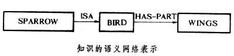

# 知识表示

原文： https://www.baike.com/wiki/知识表示/490719?view_id=5o4b7itx90xlog

### 一. 定义

​        **知识表示**，是指为使计算机程序表现一定智能行为而对所需知识采取的结构形式和解释过程。为了便于对各种表示方式[进行](https://www.baike.com/wikiid/6065497032296013164?from=wiki_content&prd=innerlink)比较，对知识的表示可提出表示域和粒度、语义基元和表示的不确定性、模块性和可理解性、显式表示和灵活性、陈述性表示方式和过程性表示方式等特征。

### 二. 知识类型

​        从便于表示和运用的角度出发，可将知识分为4种类型。

* **事实**：反映某一对象或一类对象的属性，如北京是中国的首都，鸟有双翼。

* **事件和事件序列**：有时还要提出时间、场合和因果关系，如鉴定会将于明天举行，这次鉴定会要鉴定的机器是中国自行设计制造的。

* **办事、操作等行为**：如下棋、证明定理、医疗诊断等。

* **元知识**：即知识的知识，关于如何表示知识和运用知识的知识。以规则形式表示的元知识称为元规则，用来指导规则的选用。运用元知识进行的推理称为元推理。

### 三. 知识表示的特征

​        为了便于对各种表示方式进行比较，对知识的表示可提出表示域和粒度、[语义基元](https://www.baike.com/wikiid/8398522550060280310?from=wiki_content&prd=innerlink)和表示的不确定性、模块性和可理解性、显式表示和灵活性、陈述性表示方式和过程性表示方式等特征。

​        知识的表示域和粒度 所需表示的**范围和细微程度**。例如，逻辑表示用于数学定理证明时，其表示粒度已够“细”，但用于机器视觉的程序时，其表示粒度就嫌太“粗”。

### 四. 语义基元和表示的不确定性

​        用**自然语言**的表示方式中，词是具有独立意义的最小语言单元。**词**就是语义基元。在知识表示方式的研究中，将语义基元推广为在给定的表示方式中不加定义而采用的基本符号。

​        例如在符号逻辑表示方式中究竟采用什么样的谓词和函词，在[语义网络](https://www.baike.com/wikiid/3559932846944244547?from=wiki_content&prd=innerlink)表示方式中究竟采用什么样的节点和链，都涉及语义基元的选取问题。在确定知识表示方式时必须同时考虑这种表示方式的语义基元。

​        例如“BIRD HASWINGS(鸟有翼)”这一事实即使确定了采用逻辑表示方式，也还有不同的具体表示方法。HAS-WINGS (BIRD)用的是一元谓词，而HAS-PART（BIRD,WINGS）则用的是二元谓词；用语义网络表示一系列有联系的二元关系比逻辑表示更直观而方便,如“SPARROW IS A BIRD”（麻雀是鸟）、“BIRD HAS WINGS”（鸟有翼）这两个事实就可用由三节点、双链构成的语义网络表示（见图）,图中还隐含了“SPARROW HAS WINGS（麻雀有翼）”这一事实。语义基元的选取尚未形成严格的理论，从实用的角度看，必须兼顾表达力和使用的方便性。

### 五. 模块性和可理解性

​        **模块性**，指增添、修改和删除个别知识条款而不影响其他知识有效使用的相对独立性，模块性强的系统可理解性也好。非模块性系统中知识的意义一般取决于使用时的前后关系（常规的计算机程序就是一个典型例子）。人的许多知识，特别是直观知识，有时很难用相互独立的规则或事实来描述，因此仍然需要非模块的表示方式。

​        **显式表示和灵活性**，对程序设计人员和知识型系统来说,显式表示意味着知识的存取是直接的、可控的,并能对它进行宏观解释。这就使同一知识可以从多方面应用而具有灵活性。例如在医疗诊断系统 MYCIN（见专家系统）中，显式表示的产生式规则可在诊断模块、说明程序和知识获取等程序中应用。知识工程面临的重大任务之一就是如何将人的“只可意会不可言传”性质的隐含的直观经验知识和技能显式地表现出来。

​        **陈述性**，表示方式和过程性表示方式 这是知识理论中的经典问题。知识可表示为对事物或其相互关系的静态陈述，也可表示为事件或行为的动态过程。所有知识表示方式都可看成两者之一或两者的结合。两种表示方式虽有差异性，但是也能在一定条件下相互转化。例如LISP语言中程序（过程）和数据（事实）具有统一的形式，PROLOG语言的语句也有陈述性语义和过程性语义的统一。

### 六. 知识表示的具体方式

​        在**问题求解**中，问题的状态空间表示法与问题归约表示法是最早的知识表示方式。知识型系统强调与问题领域有关的专门知识和一般常识。常用的知识表示方式有：逻辑表示、过程表示、语义网络、产生式系统、类比表示、框架型表示方式等。